# Active-Directory-Splunk-SOC-Lab
A simulated enterprise SOC environment built to practice security monitoring, SIEM detection engineering, alert triage and incident investigation.

The lab uses Windows Server 2022, Active Directory, Sysmon, Splunk Universal Forwarder, and Splunk Enterprise running on Ubuntu. Security telemetry is generated in the Windows environment, forwarded to Splunk and investigated using SPL queries.

The project focuses on the analyst workflow: validating alerts, identifying affected users and hosts, reviewing authentication and process activity, correlating surrounding events, assessing whether activity is authorised or suspicious, mapping findings to MITRE ATT&CK and documenting recommended response actions.

## Overview

This project is a simulated enterprise Active Directory environment designed to demonstrate SOC monitoring, Windows security event monitoring, threat detection and incident investigation.

The lab replicates a small corporate network where a Windows Server 2022 Domain Controller provides identity and access management, while Splunk acts as the SIEM. I am running Splunk Universal Forwarder to send Windows Event Logs to a Splunk Enterprise instance running on Ubuntu.

## Skills Demonstrated

* Windows Security Event analysis
* Active Directory monitoring
* Sysmon telemetry analysis
* SPL-based detection
* Alert validation and triage
* Event correlation
* PowerShell investigation
* Threat-intelligence enrichment
* MITRE ATT&CK mapping
* Incident documentation
* False-positive assessment
* Recommended response actions

## Project Highlights

* Built a simulated Windows enterprise environment using Windows Server 2022 and Active Directory.
* Forwarded Windows Security and Sysmon telemetry to Splunk Enterprise using Splunk Universal Forwarder.
* Created SPL-based detections for failed logins, account creation, privileged group changes and suspicious PowerShell activity.
* Investigated simulated authentication, process creation and network activity.
* Classified alerts as authorised, benign or potentially malicious based on available evidence.
* Documented findings, root cause, MITRE ATT&CK mappings and recommended response actions.

## Lab Architecture

**Windows Server 2022**
* Active Directory Domain Controller
* DNS Server
* User and Group Management
* Security Event Generation
* Splunk Universal Forwarder

**Ubuntu**
* Splunk Enterprise SIEM
* Log Ingestion and Analysis
* Detection rules and dashboards

**Network Diagram**

## SOC Investigation Workflow

```mermaid
flowchart LR
    A[Alert Generated] --> B[Validate Detection]
    B --> C[Identify User / Host]
    C --> D[Review Relevant Events]
    D --> E[Examine Process / Authentication / Network Activity]
    E --> F[Correlate Surrounding Activity]
    F --> G[Threat Intelligence Enrichment]
    G --> H[Determine Classification]
    H --> I[Map to MITRE ATT&CK]
    I --> J[Document Findings]
    J --> K[Recommend Response]
```

## Objectives

The project aims to simulate common security scenarios such as:

* Brute force attacks
* Privileged account changes
* Suspicious authentication activity
* PowerShell abuse
* Account manipulation

The overall objective is to gain practical experience with the technologies and investigation processes used by SOC analysts

## Detection Engineering

I created the following alerts in Splunk:

* Failed Login (index=main source="WinEventLog:Security" EventCode=4625)

* Successful Login (index=main source="WinEventLog:Security" EventCode=4624)

* User Account Created (index=main source="WinEventLog:Security" EventCode=4720)

* User Added to Privileged Group (index=main source="WinEventLog:Security" EventCode=4728)

I then activated all my new alerts as a test:

## Incidents

From there I planned out the incidents I wanted to simulate and respond to. The ones I came up with were as follows:

* Multiple Failed Logins
* New User Created
* Privileged Group Change
* Encoded PowerShell
* PowerShell Network Connections

### Incident 001 - Multiple Failed Logins

**Overview**

The first incident I simulated and responded to was an instance of multiple failed logins on a single account, as this suggests a brute force attack.

**Attack**

Repeated failed authentication attempts were made against the administrator account

**Detection**

I carried out the following SPL Query:

index=* EventCode=4625
| stats count by Account_Name, Source_Network_Address
| where count >= 3

This searches for instances of at least 3 failed logins (event 4625), and provides the name of the account and network address of the password attempt.

Here you can see the results:

**Investigation**

I reviewed:
* Source workstation
* Username targeted
* Number of failures
* Timeframe
* Authentication type

**Findings**

The detection identified multiple failed authentication attempts (Windows Event ID 4625) against the monitored system. The authentication attempts originated from "127.0.0.1", the local loopback address, indicating that the activity was generated locally on the monitored host rather than from a remote source.

Review of the available telemetry did not identify additional indicators of compromise or suspicious follow-on activity. Based on the simulated environment and the absence of supporting malicious activity, the authentication failures were assessed as benign activity, potentially consistent with an incorrectly entered password or other legitimate local authentication behaviour.

The alert itself functioned as intended by identifying the repeated failed authentication attempts. However, the underlying activity was determined to be non-malicious.

Classification: True Positive – Benign Activity

MITRE ATT&CK: T1110.001 – Password Guessing

**Outcome**

* Alert Classification: True Positive - Benign
* MITRE ATT&CK: T1110, Brute Force
* Root Cause: Authorised security testing
* Recommendation: No remediation required. Consider excluding events generated from internal sources brute-force detections.

### Incident 002 - New User Created

**Overview**

I simulated the creation of a new user on Active Directory and investigated it using Splunk, assessing whether the activity was authorised.

**Attack**

I created a new user via Active Directory with the following information:

**Detection**

Above, you will find that I created an alert - User Account Created (index=main EventCode=4720). When the user was created, this produced an alert.

Extra information available here:

From here, I can ascertain whether this is legitimate.

**Investigation**

* Confirmed Event ID 4720
* Reviewed the account responsible for creating the user
* Verified the creation of the account occurred on the Domain Controller
* Assessed whether the account creation was authorised

**Findings**

The detection successfully identified the creation of a new user account through Windows Security Event ID 4720. The account was created by the "Administrator" account on the Domain Controller.

Review of the available event data did not identify any additional suspicious activity associated with the account creation. Within the context of the simulated environment, the account creation was assessed as an authorised administrative change.

The detection therefore operated as expected and correctly identified the relevant security event. However, the underlying activity was determined to be legitimate rather than malicious.

Classification: True Positive – Authorised Activity

MITRE ATT&CK: T1136 – Create Account

**Outcome**

* Alert Classification: True Positive (Authorised activity)
* MITRE ATT&CK: T1136
* Root Cause: Authorised account creation
* Recommendation: No immediate action required. Ensure user account creation follows the change management process and is appropriately documented

### Incident 003 - Privileged Group Change

**Overview**

Next, I responded to a new user being added to a privileged group and investigated it using Splunk.

**Attack**

I added the user David Wilson to the Finance group via Active Directory.

**Detection**

The "User added to privileged group" alert I created earlier was activated and it appeared in my alerts

**Investigation**

* Confirmed Event 4728
* Reviewed the account responsible for changing the privileges
* Verified the privilege change occurred on the Domain Controller
* Assessed whether the privilege change was authorised

**Findings**

The detection successfully identified the addition of a user account to a privileged security group through Windows Security Event ID 4728. The change was performed by the "Administrator" account on the Domain Controller.

As membership changes to privileged groups can result in elevated access, the activity was reviewed as a potential privilege escalation event. The available telemetry did not identify any additional suspicious activity associated with the change, and the modification was consistent with an authorised administrative action within the simulated environment.

The detection therefore operated as intended by identifying a security-sensitive change to privileged group membership. The underlying activity was assessed as legitimate and did not require remediation.

Classification: True Positive – Authorised Activity

MITRE ATT&CK: T1098 - Account Manipulation
**Outcome**
* Alert Classification: True Positive (Authorised activity)
* MITRE ATT&CK: T109
* Root Cause: Authorised change to a user's privileges
* Recommendation: No immediate action required. Ensure the privilege escalation follows the change management process and is appropriately documented

### Incident 004 - Encoded PowerShell

**Overview**
I wanted to simulate potentially malicious PowerShell activity using an encoded command. Attackers commonly use PowerShell and command encoding to obfuscate commands and make malicious activity more difficult to identify during initial detection and investigation. This makes encoded PowerShell activity a useful behaviour for a SOC analyst to investigate.

**Attack**

I simulated a suspicious encoded PowerShell command executed on the Domain Controller. The command was encoded using Base64 and executed using PowerShell's -EncodedCommand parameter.

The decoded command performed system and user enumeration, which could be consistent with reconnaissance activity following initial access.

The command was executed using:
powershell.exe -EncodedCommand VwByAGkAdABlAC0ASABvAHMAdAAgACcARQBuAGMAbwBkAGUAZAAgAFAAbwB3AGUAcgBTAGgAZQBsAGwAIAB0AGUAcwB0ACcA.

The activity generated a Sysmon Event ID 1 (Process Creation) event, which was forwarded to Splunk for detection.

**Detection**

I created the following Splunk alert to identify PowerShell processes using common encoded-command parameters: "index=main sourcetype="XmlWinEventLog:Microsoft-Windows-Sysmon/Operational" EventCode=1 "-enc" OR "-EncodedCommand" OR "-ec"
| table _time, host, _raw" and saved it as an alert called "Encoded Command - PowerShell".

You can see it was activated here:

**Investigation**

I investigated the alert to determine:

* Which user executed the PowerShell process
* Which host the command originated from
* The parent process that launched PowerShell
* The command-line arguments used
* Whether the PowerShell command was encoded
* What the decoded command attempted to do
* Whether the activity was consistent with legitimate administrative behaviour
* Whether there were any additional indicators of compromise associated with the activity

**Findings**

The investigation confirmed that an encoded PowerShell command had been executed by a user on the Domain Controller.

The use of -EncodedCommand was considered suspicious because command encoding can be used to obscure PowerShell activity from basic security monitoring. The decoded command performed system/user enumeration, which could represent reconnaissance activity.

The execution context, user account, parent process and surrounding events were reviewed to determine whether the activity could be attributed to an authorised administrative task. No legitimate change or administrative requirement was identified to explain the activity.

The activity was therefore classified as potentially malicious and escalated for further investigation.

**Outcome**

* Alert Classification: True Positive – Suspicious/Malicious Activity
* MITRE ATT&CK: T1059.001 – Command and Scripting Interpreter: PowerShell
* Recommendation: Isolate or further investigate the affected host and user account as appropriate. Review surrounding authentication, process creation and network activity for additional indicators of compromise. Determine whether the account or host has been compromised and investigate any subsequent activity. Consider implementing additional PowerShell logging and monitoring for encoded commands, particularly when originating from unexpected users, hosts or parent processes.

### Incident 005 - PowerShell Network Connections

**Overview**

I wanted to simulate a network connection being established by PowerShell and investigate whether the resulting activity could be considered suspicious or malicious.

PowerShell is commonly used for legitimate administration but can also be abused by attackers to perform reconnaissance, download payloads, or communicate with external infrastructure. Monitoring network connections initiated by PowerShell can therefore provide useful context when investigating potentially malicious activity.

**Attack**

I simulated a network connection being established through PowerShell by executing a command that connected to www.example.com.

The purpose of the simulation was to generate a Sysmon Event ID 3 (Network Connection) event that could be detected and investigated in Splunk.

The command was executed within PowerShell on the Windows Server/Domain Controller.

**Detection**

I created the following Splunk alert to detect network connections recorded by Sysmon:

'index=main source="WinEventLog:Microsoft-Windows-Sysmon/Operational" EventCode=3
| search process_name="*powershell.exe"
| table _time host user process_name destination_ip destination_port protocol' 

and saved as PowerShell Network Connection.

The alert was successfully triggered when the simulated network connection was established.

Sysmon Event ID 3 records network connections made by processes and provides useful information such as the source process, source and destination addresses, ports and protocol.

**Investigation**

I investigated the alert to determine:

* Which process initiated the network connection
* Which user account was responsible for the activity
* The destination IP address and/or domain
* The destination port and network protocol
* Whether the destination was associated with known malicious infrastructure
* Whether the activity appeared consistent with legitimate administrative behaviour
* Whether any additional suspicious activity occurred around the same time

**Findings**

The investigation confirmed that a network connection had been established by PowerShell.

The connection was made to www.example.com. I investigated the destination using VirusTotal, which did not identify the destination as malicious.

I also reviewed the user and process responsible for the connection and found no additional indicators of compromise associated with the activity. The connection was therefore assessed as benign and consistent with the intended simulation.

It is important to note that a clean VirusTotal result does not by itself prove that network activity is legitimate. The destination reputation was considered alongside the process, user, destination and surrounding activity when reaching the final assessment.

**Outcome**

* Alert Classification: True Positive – Benign Activity
* MITRE ATT&CK: T1059.001 – Command and Scripting Interpreter: PowerShell
* Root Cause: An authorised PowerShell process established an outbound network connection to www.example.com as part of a controlled security lab simulation.
* Recommendation: No immediate action required. Continue monitoring PowerShell network activity and investigate connections to unknown, suspicious or known-malicious destinations. Where appropriate, correlate network connection events with process creation, user activity and other endpoint telemetry to identify potentially malicious PowerShell behaviour.

## Technologies Used

| Category | Technologies |
|---|---|
| SIEM | Splunk Enterprise, SPL |
| Operating Systems | Windows Server 2022, Ubuntu |
| Identity | Active Directory, users, groups and OUs |
| Telemetry | Windows Security Event Logs, Sysmon |
| Log Collection | Splunk Universal Forwarder |
| Investigation | Event correlation, process analysis, authentication analysis |
| Threat Intelligence | VirusTotal |
| Framework | MITRE ATT&CK |
| Virtualisation | VMware Workstation |

## Key Lessons

The project demonstrated that receiving an alert is only the beginning of a SOC investigation.

From there, I learned I must focus on:

* What happened?
* Who performed the activity?
* Which host was involved?
* Was the activity authorised?
* What happened immediately before or after the alert?
* Are there indicators of compromise?

## Known Limitations

* The environment represents a small simulated enterprise network.
* The scenarios were controlled and generated by the author.
* Some activity was authorised or intentionally benign.
* The available telemetry was limited to the configured Windows and Sysmon
  event sources.
* The project does not demonstrate production incident response.
* No claims are made about detection performance in a live enterprise.
* Some investigations would require additional endpoint, identity or network
telemetry in a production environment.

